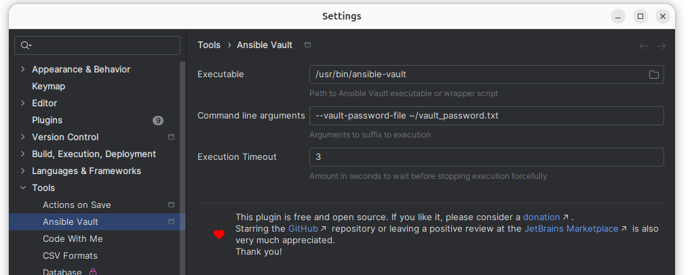
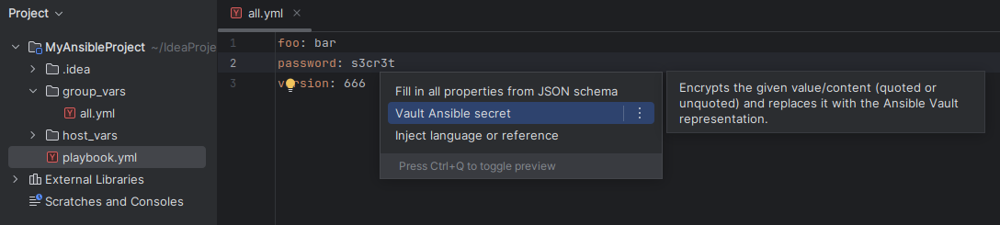
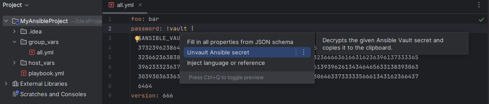
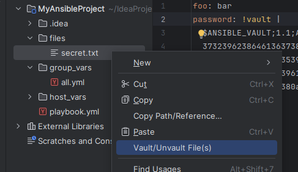
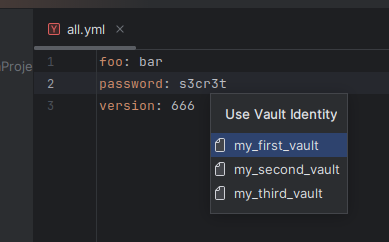

#   IDEA&nbsp;Ansible&nbsp;Vault&nbsp;Integration

> Integrate _Ansible Vault_ directly into _IntelliJ IDEA_ with context actions for vaulting and unvaulting secrets.

> [!NOTE]  
> This project/plugin was [originally](https://github.com/timo-reymann/idea-ansible-vault-integration) created by [Timo Reymann](https://github.com/timo-reymann).  
>
> Timo decided to hand the plugin over to me ([4ch1m](https://github.com/4ch1m)) for future development and maintenance.  
> So credits and thanks go out to Timo for creating this helpful plugin in the first place. :+1: :bow:
> 
> Starting with `4.0.0`, all future versions of this plugin (available on the [JetBrains Marketplace](https://plugins.jetbrains.com/plugin/14353-ansible-vault-integration)) will be built from this fork/repository.  

* [Installation](#installation)
* [Setup](#setup)
* [Usage](#usage)
    * [Basic Features](#basic-features)
        * [Vaulting variables](#vaulting-variables)
        * [Unvaulting variables](#unvaulting-variables)
        * [(Un)Vaulting files](#unvaulting-files)
    * [Additional Features](#additional-features)
        * [Identity handling](#identity-handling)
        * [Environment variables](#environment-variables)
* [License](#license)
* [Credits](#credits)
* [Donate](#donate)

## Installation

Use the IDE's built-in plugin system:

* `File` --> `Settings...` --> `Plugins` --> `Marketplace`
* search for: `Ansible Vault Integration`
* click the `Install`-button

Or go to the [plugin page](https://plugins.jetbrains.com/plugin/14353-ansible-vault-integration) on the [JetBrains](https://www.jetbrains.com)-website, download the archive-file and install manually.

## Setup

Use the settings dialog of the plugin to adjust everything as needed.

> 

Using the `Command line arguments` you can set your preferred way of providing the vault-password.

e.g.:

| Arguments                                           | Effect                                                         |
|:----------------------------------------------------|:---------------------------------------------------------------|
| `--vault-password-file .project-secret`             | use secret stored in project                                   |
| `--vault-password-file ~/.ansible-secret`           | use secret stored in home directory                            |
| `--vault-password-file .idea-get-vault-password.sh` | generate secret from script (check detailed explanation below) |

## Usage

### Basic Features

#### Vaulting variables

Vault any variable from within your YAML file.  

Simply ...
 
* place the cursor over the variable's content/value
* hit <kbd>Alt</kbd> + <kbd>Enter</kbd>
* choose "_Vault Ansible secret_"

... done!

> 

#### Unvaulting variables

Unvaulting is as just as easy.

* place your cursor over the vaulted secret
* hit <kbd>Alt</kbd> + <kbd>Enter</kbd>
* choose "_Unvault Ansible secret_"

The decrypted content is now in your clipboard for further usage.

> 

#### (Un)Vaulting files

Vaulting and unvaulting whole files is also possible via the file's context-menu.

> 

### Additional Features

#### Identity handling

The plugin greatly simplifies the usage of multiple Ansible Vault identities.

Adjust your [Ansible configuration](https://docs.ansible.com/ansible/latest/reference_appendices/config.html#ansible-configuration-settings-locations) as needed.  
The vault action then will provide the according options.

e.g.:

```
[defaults]
vault_identity_list = my_first_vault@~/ansible/passwords/my_first_vault, my_second_vault@~/ansible/passwords/my_second_vault, my_third_vault@~/ansible/passwords/my_third_vault
```

> 

#### Environment variables

_Ansible Vault_ lets you provide passwords not only from a static plaintext file, but also an executable script.

If the file referenced via `--vault-password-file` is being detected as an executable, then its (StdOut-)return value will be used as passphrase. 

To give you full control, the plugin provides the following environment variables (ready to be used in the password-file-script):

| Environment variable                           | Content                                                                                 |
|:-----------------------------------------------|:----------------------------------------------------------------------------------------|
| `IDEA_ANSIBLE_VAULT_CONTEXT_FILE`              | absolute path to the file the vault/unvault action was triggered in                     |
| `IDEA_ANSIBLE_VAULT_CONTEXT_DIRECTORY`         | name of the directory the vault/unvault action was triggered in (**NOT** the full path) |
| `IDEA_ANSIBLE_VAULT_CONTEXT_PROJECT_BASE_PATH` | absolute path of the project the vault/unvault action was triggered in                  |
| `IDEA_ANSIBLE_VAULT_CONTEXT_PROJECT_NAME`      | name of the project the action was triggered in                                         |

**Example: Configure secret based on maturity**

Let's say you have an Ansible setup with three stages (`dev`, `qa`, `prod`), with the following directory structure:

```
group-vars/
    all/vars.yml
    dev/vars.yml
    qa/vars.yml
    prod/vars.yml
```

For each maturity you have a different vault file (following this pattern: `.${maturity}.secret`), you can use the following configuration:

* use CLI args `--vault-password-file .idea-get-vault-password.sh` in plugin settings
* create the file `.idea-get-vault-password.sh` (`0700`) in your project root

```bash
#!/usr/bin/env bash

# Helper to show error message
__error_message() {
   >&2 echo "$1"
   exit 2
}

# Check script is not called directly
if [ -z "$IDEA_ANSIBLE_VAULT_CONTEXT_DIRECTORY" ]
then
  __error_message "Call is not coming from IntelliJ Plugin"
fi

# Check context folder
case "$IDEA_ANSIBLE_VAULT_CONTEXT_DIRECTORY" in
  # known maturities
  dev|qa|prod)
    secret_file=".${IDEA_ANSIBLE_VAULT_CONTEXT_DIRECTORY}.secret"
    if [ -f "$secret_file" ]
    then
      cat  ".${IDEA_ANSIBLE_VAULT_CONTEXT_DIRECTORY}.secret"
    else
      __error_message "Secret file '${secret_file}' not found"
    fi
    ;;

  # whoops something went wrong
  *)
    __error_message "Unsupported folder"
    exit 2
    ;;
esac
```

It's magic! :magic_wand:

## License

Please read the [license](LICENSE) file.

## Credits

Icons from [FontAwesome](https://fontawesome.com/):
* [Vault](https://fontawesome.com/icons/vault?s=solid&f=classic) 
* [Heart](https://fontawesome.com/icons/heart?s=solid&f=classic) 

## Donate

If you like this plugin, please consider a [donation](https://paypal.me/AchimSeufert). Thank you!
